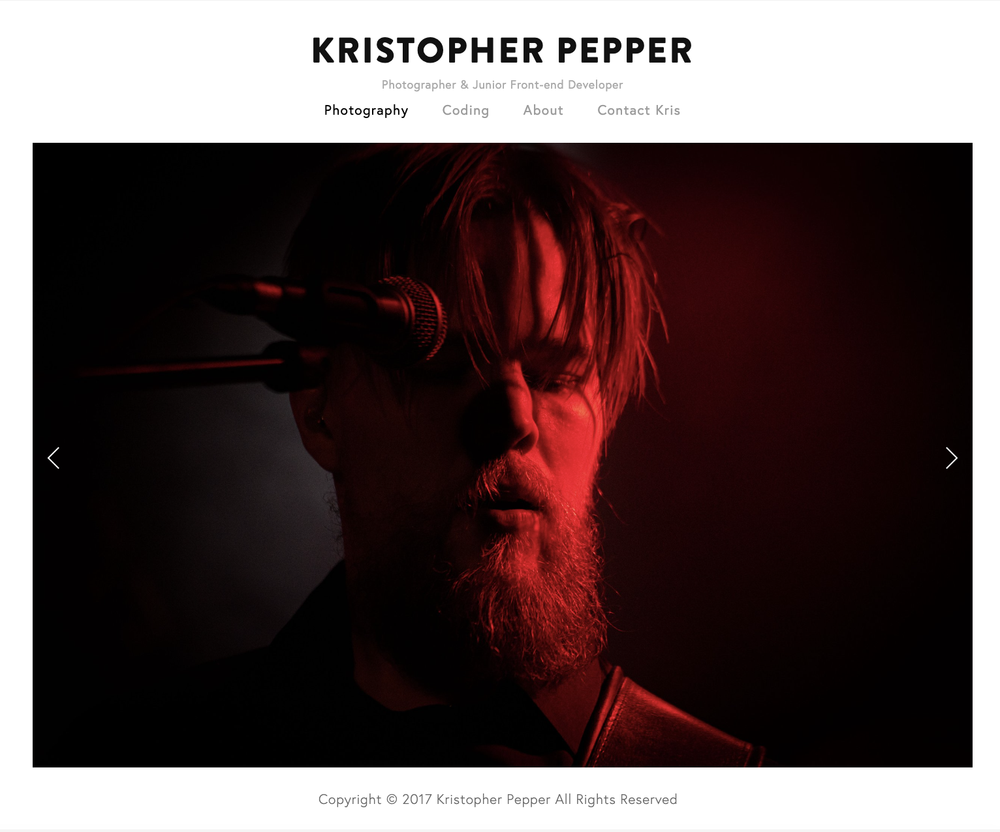
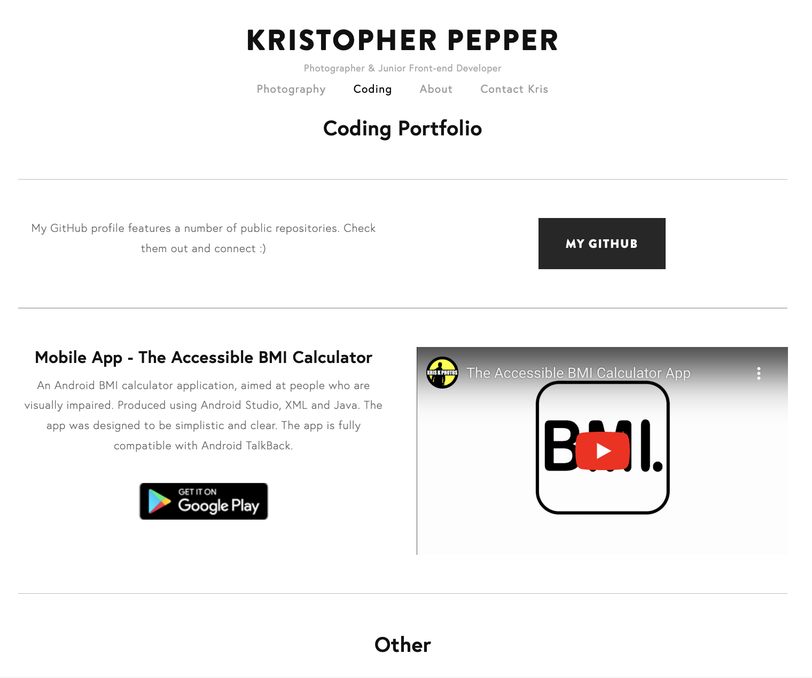
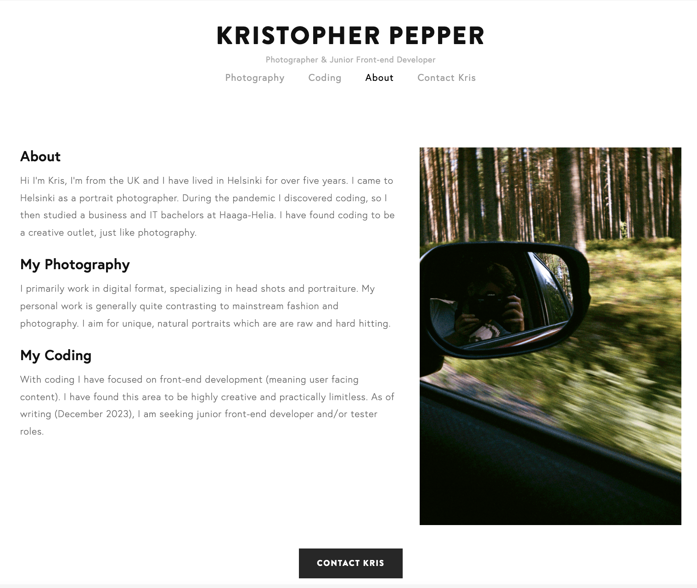
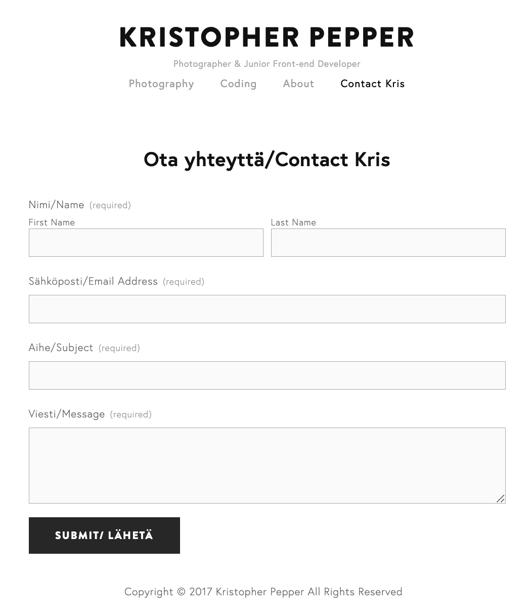

# Squarespace-Personal-Website

### About

- In early 2017 I was studying photography in London, I published a Squarespace website as a personal portfolio.
- I kept the site for 7 years until I deactivated it in early 2024.
- I experimented with different content and styles.
- The final version was a clear, consise and high-key. The screen shots below show the different pages.

My Site

Home Page

Coding Page

About Page

Contact Page

Editing the Site

Shows how the user can choose different page components

Shows how the user can customize page components

